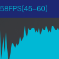
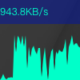

webrtc-stats
========

[![NPM package][npm]][npm-url]
[![Build Size][build-size]][build-size-url]
[![Build Status][build-status]][build-status-url]
[![Dependencies][dependencies]][dependencies-url]
[![Dev Dependencies][dev-dependencies]][dev-dependencies-url]
[![Language Grade][lgtm]][lgtm-url]

#### Webrtc tools  ####
show webrtc connect stats with graphics

　　

#### Install ####
```bash
    npm install webrtc-stat
```

#### Usage ####
Javascript
```javascript
  import { Renderer } from 'webrtc-stat';
  const renderer = Renderer.fromPeerConnection(pc, interval);
  // pc: RTCPeerConnection interval: number
```

Html:
```
<script src="https://raw.githubusercontent.com/caohanghust/webrtc-stats/master/dist/index.js"/>
<script>
    const renderer = Renderer.fromPeerConnection(pc, interval);
    // pc: RTCPeerConnection interval: number
</script>
```
